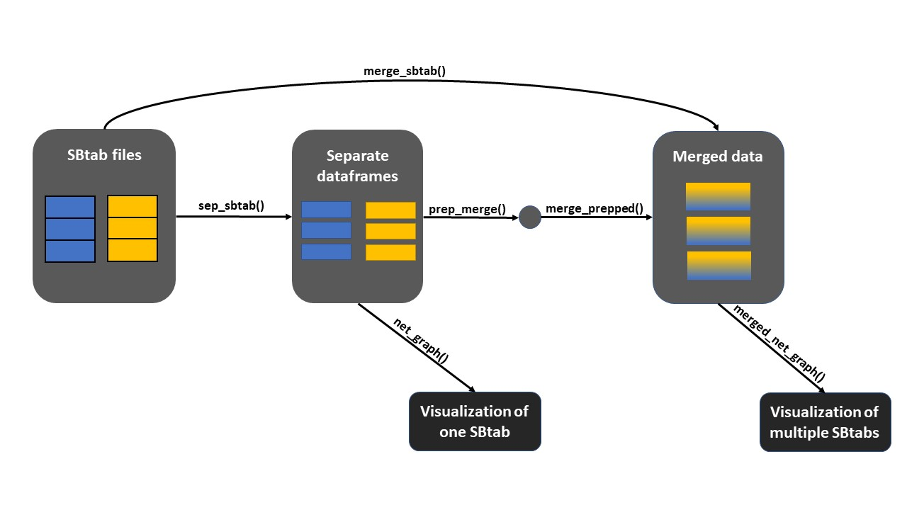

# SBtab merging {#SBTAB}

Our team, including C. Niemel, J. Nijdam, and myself, developed an R package for the ONTOX project in collaboration with the Life Sciences and Chemistry mentorship at the University of Applied Sciences in Utrecht. The ONTOX project's goal is to reduce animal testing in toxicology through ways like optimizing the utilization of existing data with artificial intelligence and SysRev, a software platform that extracts relevant data from scientific documents and presents it in SBtab format. The package we created can merge multiple SBtab files and visualize the data as a network using six functions, including four for merging files and two for visualizing them. Figure 2.1 depicts the workflow. These functions streamline the identification of correlations and the development of predictive models, which could improve human risk assessment.

My contribution within this project consists of the merging functions. 

- sep_sbtab(), separates tables in the SBtab and creates an edges table for visualisations purposes
- prep_merge(), prepares the tables for merging by making the identifiers unique across files
- merge_prep(), merges the prepped tables
- merge_sbtab(), performs all three of the above functions at once