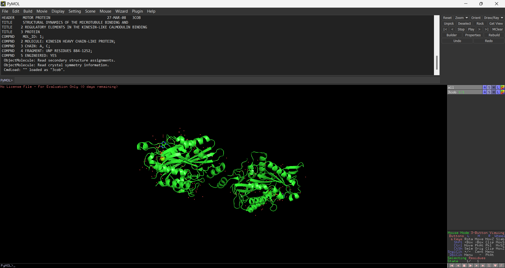
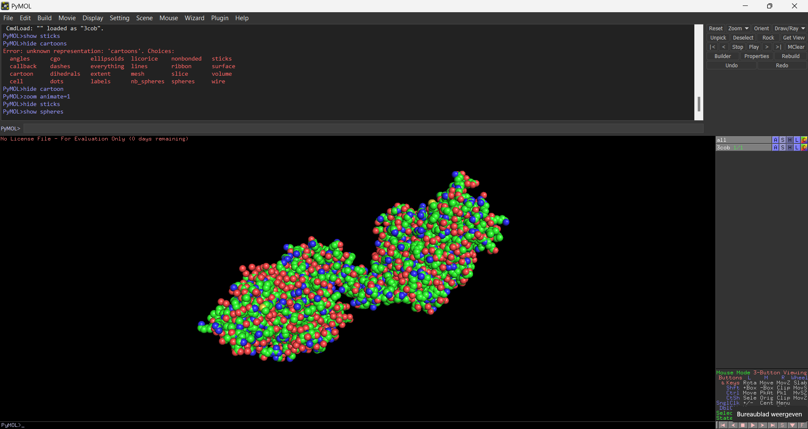
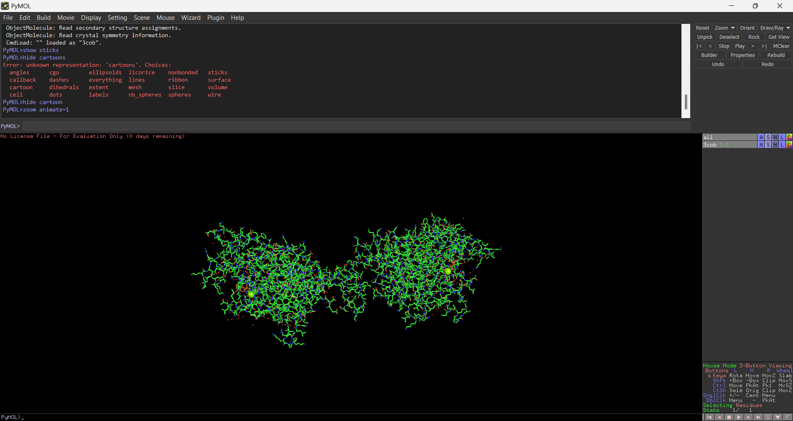

# Protein structures in R {#freeassignment}

_As part of assignment 3.2 from the [DSFB2 Workflows course](https://lesmaterialen.rstudio.hu.nl/workflows-reader/#course-introduction) and as a continuation from [chapter 3](Workflows_Portfolio_3.html)._

----

In order to prepare for the future and find direction in my career I have decided to point this free assignment at structural biology. There are two paths within three-dimensional structural bioinformatics, one focusing on the evolutionary history and the other on the physical interactions [@jumperHighlyAccurateProtein2021]. Since I am most interested in the latter, I will be doing the following:
<ol>
<li>Research databases and formats with protein structure data</li>
<li>Research visualization methods for protein structure</li>
<li>Visualise kinesin using R</li>
<li>Reflecting and looking forward</li>
</ol>

----

## Protein structure data

In the past decade the use of high-throughput technologies within the biomedical field has vastly increased. Studies about genomics, transcriptomics and proteomics are supported by more and more databases and software tools. There's a large variety of types for bioinformatics databases like sequences, enzyme/pathway, chemistry or 3D structures. [@chenProteinBioinformaticsDatabases2017] We will mostly be looking at the 3D structures, which quickly brings us to [wwPDB](http://www.wwpdb.org/).

### Protein Data Bank Archive

When it comes to databases for 3D protein structures, the worldwide PDB (Protein Data Bank archive) was announced in 2003 [@bermanAnnouncingWorldwideProtein2003]. This international collaboration includes PDBe (Europe), PDBj (Japan), RCSB PDB (Research Collaboratory for Structural Bioinformatics) and BMRB (Biological Magnetic Resonance Bank). The archive offers three formats per file, legacy PDB, PDBx/mmCIF and PDBML. As of December 1st 2015 there are 113,971 biological macromolecular structures in the wwPDB database including 37,049 distinct protein sequences, 30,099 structures of human sequences, 8,096 Nucleic Acid containing structures. [@chenProteinBioinformaticsDatabases2017]

### PDBx/MMcif format

One of the file formats used and implemented by wwPDB is PDBx/MMcif. It comes from the CIF (Crystallopgrahic Information File) format which was developed for small crystallographic molecules. As it expanded it also included macromolecules and the name was changed to MMcif. 

It's strengths lie in it's ability to archive structural models of any size and being fully machine-readable. With all it's advantages compared to other formats, like legacy PDB, PDBx/MMcif became the main format of use for wwPDB in 2007. In 2011 it was also adopted by multiple major software developers for the visualizations of molecules. [@burleyProteinDataBank2017]

----

## Visualization methods

There are multiple programs for the visualization of protein structures, like [PyMol](https://pymol.org/2/), [UCSF's Chimera](https://www.cgl.ucsf.edu/chimera/) and [OpenRasMol](http://www.openrasmol.org/). To take a closer look at what these types of programs are all about and the different ways of visualizing protein structures, PyMol was downloaded. For this analysis we will be looking at my favorite protein, kinesin. The PDBx file for kinesin was taken from [3COB](https://www.rcsb.org/structure/3COB) in the RCSB database. After uploading the PDBx file to PyMol, the protein was first shown as in figure 9.1.



In this first visualization the protein is shown in what is known as a 'cartoon' form. It is a simplified version where sidechains are ignored. Only the backbone is shown with the alpha helices as coils and the beta sheets as arrows. This leaves a lot of valuable information out so other styles are needed. To show different forms the external GUI (top window) can be used, as it's text area logs commands. We'll use this to look at two different visualization styles, spheres and sticks.

PyMol makes switching between visualizations really easy. To show a different type, like spheres, the command is <i>'show sphere'</i>. To hide another, like cartoon, the command is <i>'hide cartoon'</i>. After these commands only the spheres are shown, as seen in figure 9.2.



Spheres, unlike cartoon, shows the atoms (see figure 9.2). Each atom is shown as a sphere. The size of each sphere is decided by the atoms electron orbitals. This can be used to show packing and spheric hindrance but doesn't show the interior. The colors indicate different atoms, in the default settings carbon atoms are green, nitrogen is blue, oxygen is red, etc.

The last visual style will be sticks, this shows the chemical structure (see figure 9.3). The colors still indicate the same atoms as they did for the sphere style.



----

## Applying in R

It is also possible to visualize the structure in R using packages like [r3dmol](https://github.com/swsoyee/r3dmol) or [protein8k](https://github.com/SimonLiles/protein8k). Both of these packages are still in very early development with the last update being at least 5 months ago. Still, they are good resources to practice visualizing proteins in R. Using the r3dmol package I will try to replicate the visuals as seen using PyMol. The r3dmol functions have been used to create four functions, [protein_cartoon](https://github.com/mirthhe/portrobbo/blob/main/R/protein_cartoon.R), [protein_stick](https://github.com/mirthhe/portrobbo/blob/main/R/protein_stick.R), [protein_sphere](https://github.com/mirthhe/portrobbo/blob/main/R/protein_sphere.R) and [protein_visual](https://github.com/mirthhe/portrobbo/blob/main/R/protein_visual.R) in the portrobbo package. The input for the functions is a PDBx file, turned into an R object using the readLines() function. The portrobbo package comes with an ready-made object called kinesin, this is from the earlier used PDBx file taken from [3COB](https://www.rcsb.org/structure/3COB).

The PyMol visuals will be recreated using these functions and the kinesin object. At first I tried using the <i>colorScheme = "ssPyMOL"</i> option but this did not seem to work as promised so I went over the elements separately to match the colors. 

### Cartoon visual

With the first visual, cartoon style, PyMOL uses the HEX code #3aff3a for both the beta sheets and alpha helices. The beta sheets are also accompanied by an arrow to indicate the direction. Both of these characteristics have been incorporated in the function. One thing the result does not recreate is the small spheres, showing specific atoms. The result can be seen in interactive figure 9.4.

<details><summary>Function protein_cartoon()</summary>
```{r protein_cartoon, eval=FALSE}
protein_cartoon <- function(pdbobject){
  r3dmol(
    viewer_spec = m_viewer_spec(
      # How far user can zoom in
      lowerZoomLimit = 30,
      # How far user can zoom out
      upperZoomLimit = 400,
      # Decrease quality to improve performance
      antialias = FALSE,
      disableFog = TRUE,
      backgroundColor = "black")) %>%
    # Adding the protein
    m_add_model(data = pdbobject, format = "pdb") %>%
    # Center the protein at first
    m_zoom_to() %>%
    # Set style of structures
    m_set_style(
      sel = m_sel(ss = "s"), # Style beta sheets
      style = m_style_cartoon(color = "#3aff3a", arrows = TRUE)) %>%
    m_set_style(
      sel = m_sel(ss = "h"), # Style alpha helix
      style = m_style_cartoon(color = "#3aff3a")) %>%
    # Rotate the scene by given angle on given axis
    m_rotate(angle = 90, axis = "y")
}
```
</details>

```{r cartoon kinesin}
# The kinesin file used earlier has been incorporated in the portrobbo package
# The r3dmol package has been incorporated in the protein_* functions of the portrobbo package
protein_cartoon(kinesin)
```

_Figure 9.4 Kinesin as described by the 3COB PDBx file from wwPDB. Visualised in cartoon style using the r3dmol package and PyMOL color scheme. Using a click and drag methode the image can be turned and by scrolling the image can be zoomed in and out._

### Sphere and sticks visual

For the spheres and sticks visuals the recreation is more accurate than the cartoon visual. All atoms got their own color, as stated on the [PyMOLWiki](https://pymolwiki.org/index.php/Color_Values). The functions can be seen below and the results in interactive figures 9.5 and 9.6.

<details><summary>Function protein_sphere()</summary>
```{r protein_sphere, eval=FALSE}
protein_sphere <- function(pdbobject){
  r3dmol(
    viewer_spec = m_viewer_spec(
      # How far user can zoom in
      lowerZoomLimit = 30,
      # How far user can zoom out
      upperZoomLimit = 400,
      # Decrease quality to improve performance
      antialias = FALSE,
      disableFog = TRUE,
      backgroundColor = "black")) %>%
    # Adding the protein
    m_add_model(data = pdbobject, format = "pdb") %>%
    # Center the protein at first
    m_zoom_to() %>%
    # Set style of atoms
    m_set_style(
      sel = m_sel(elem = "C"), # Style carbon
      style = m_style_sphere(color = "#33ff33")) %>%
    m_set_style(
      sel = m_sel(elem = "N"), # Style nitrogen
      style = m_style_sphere(color = "#3333ff")) %>%
    m_set_style(
      sel = m_sel(elem = "O"), # Style oxygen
      style = m_style_sphere(color = "#ff4c4c")) %>%
    m_set_style(
      sel = m_sel(elem = "S"), # Style sulfur
      style = m_style_sphere(color = "#e5c53f")) %>%
    m_set_style(
      sel = m_sel(elem = "P"), # Style phosphorus
      style = m_style_sphere(color = "#ff7f00")) %>%
    m_set_style(
      sel = m_sel(elem = "MG"), # Style magnesium
      style = m_style_sphere(color = "#8aff00")) %>%
    # Rotate by given angle on given axis
    m_rotate(angle = 90, axis = "y")
}
```
</details>
<details><summary>Function protein_stick()</summary>
```{r protein_stick, eval=FALSE}
protein_sphere <- function(pdbobject){
  r3dmol(
    viewer_spec = m_viewer_spec(
      # How far user can zoom in
      lowerZoomLimit = 30,
      # How far user can zoom out
      upperZoomLimit = 400,
      # Decrease quality to improve performance
      antialias = FALSE,
      disableFog = TRUE,
      backgroundColor = "black")) %>%
    # Adding the protein
    m_add_model(data = pdbobject, format = "pdb") %>%
    # Center the protein at first
    m_zoom_to() %>%
    # Set style of atoms
    m_set_style(
      sel = m_sel(elem = "C"), # Style carbon
      style = m_style_stick(color = "#33ff33")) %>%
    m_set_style(
      sel = m_sel(elem = "N"), # Style nitrogen
      style = m_style_stick(color = "#3333ff")) %>%
    m_set_style(
      sel = m_sel(elem = "O"), # Style oxygen
      style = m_style_stick(color = "#ff4c4c")) %>%
    m_set_style(
      sel = m_sel(elem = "S"), # Style sulfur
      style = m_style_stick(color = "#e5c53f")) %>%
    m_set_style(
      sel = m_sel(elem = "P"), # Style phosphorus
      style = m_style_stick(color = "#ff7f00")) %>%
    m_set_style(
      sel = m_sel(elem = "MG"), # Style magnesium
      style = m_style_stick(color = "#8aff00")) %>%
    # Rotate by given angle on given axis
    m_rotate(angle = 90, axis = "y")
}
```
</details>

```{r sphere kinesin}
# The kinesin file used earlier has been incorporated in the portrobbo package
# The r3dmol package has been incorporated in the protein_* functions of the portrobbo package
protein_sphere(kinesin)
```

_Figure 9.5 Kinesin as described by the 3COB PDBx file from wwPDB. Visualised in sphere style using the r3dmol package and PyMOL color scheme. Using a click and drag method the image can be turned and by scrolling the image can be zoomed in and out._

```{r stick kinesin}
# The kinesin file used earlier has been incorporated in the portrobbo package
# The r3dmol package has been incorporated in the protein_* functions of the portrobbo package
protein_stick(kinesin)
```

_Figure 9.6 Kinesin as described by the 3COB PDBx file from wwPDB. Visualised in stick style using the r3dmol package and PyMOL color scheme. Using a click and drag method the image can be turned and by scrolling the image can be zoomed in and out._

### Combining styles

A big downside of these visualizations is how none of them show a complete picture. Cartoon style doesn't show the atoms, sphere styles doesn't show the chemical structure and stick style doesn't show the sferic hindrance. Because of this, one more function was made, to combine the stick and sphere visuals in a way that clearly shows both of them. To do this they were combined in one function with the stick visual on full opacity and the sphere visual on an opacity of 0.7. The result can be seen in figure 9.7. The clarity of the spherical style could be better and the overlap definitely has a negative effect on the readability, but the combination still gives a good overview of the protein's 3D structure.

<details><summary>Function protein_visual()</summary>
```{r protein_visual, eval=FALSE}
protein_visual <- function(pdbobject){
  r3dmol(
    viewer_spec = m_viewer_spec(
      # How far user can zoom in
      lowerZoomLimit = 30,
      # How far user can zoom out
      upperZoomLimit = 400,
      # Decrease quality to improve performance
      antialias = FALSE,
      disableFog = TRUE,
      backgroundColor = "black")) %>%
    # Adding the protein
    m_add_model(data = pdbobject, format = "pdb") %>%
    # Center the protein at first
    m_zoom_to() %>%
    # Set style of atoms
    m_set_style(
      sel = m_sel(elem = "C"), # Style carbon
      style = c(m_style_stick(color = "#33ff33"), m_style_sphere(opacity = 0.7, color = "#33ff33"))) %>%
    m_set_style(
      sel = m_sel(elem = "N"), # Style nitrogen
      style = c(m_style_stick(color = "#3333ff"), m_style_sphere(opacity = 0.7, color = "#3333ff"))) %>%
    m_set_style(
      sel = m_sel(elem = "O"), # Style oxygen
      style = c(m_style_stick(color = "#ff4c4c"), m_style_sphere(opacity = 0.7, color = "#ff4c4c"))) %>%
    m_set_style(
      sel = m_sel(elem = "S"), # Style sulfur
      style = c(m_style_stick(color = "#e5c53f"), m_style_sphere(opacity = 0.7, color = "#e5c53f"))) %>%
    m_set_style(
      sel = m_sel(elem = "P"), # Style phosphorus
      style = c(m_style_stick(color = "#ff7f00"), m_style_sphere(opacity = 0.7, color = "#ff7f00"))) %>%
    m_set_style(
      sel = m_sel(elem = "MG"), # Style magnesium
      style = c(m_style_stick(color = "#8aff00"), m_style_sphere(opacity = 0.7, color = "#8aff00"))) %>%
    # Rotate by given angle on given axis
    m_rotate(angle = 90, axis = "y")
}
```
</details>

```{r complete kinesin}
# The kinesin file used earlier has been incorporated in the portrobbo package
# The r3dmol package has been incorporated in the protein_* functions of the portrobbo package
protein_visual(kinesin)
```

_Figure 9.7 Kinesin as described by the 3COB PDBx file from wwPDB. Visualised in stick and spherical style using the r3dmol package and PyMOL color scheme. Using a click and drag method the image can be turned and by scrolling the image can be zoomed in and out._

----

## Looking forward

After this free assignment I've gotten a peak into the field of visualizing molecular structures. It gave me a sense of the possibilities and current state of events. Here I focused on the visualization of an existing structure after the folding has already taken place. In the future I would like to dive deeper into the prediction of protein folding, maybe one day offering a software which visualises the folding process for different proteins. My next steps in this will be literature research about protein folding and expanding my knowledge on visualization and animation techniques.