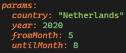
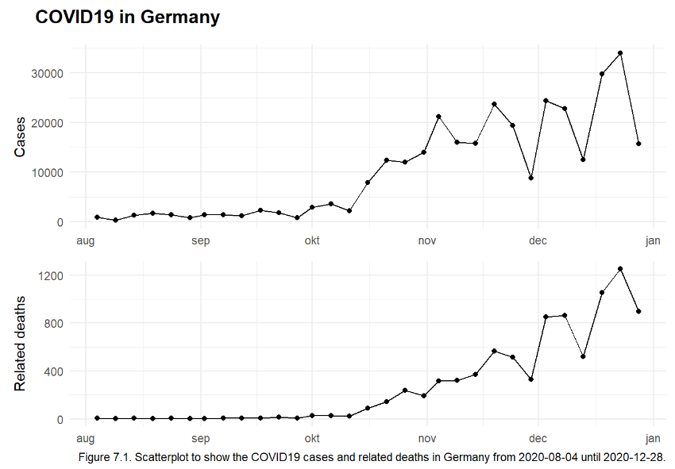
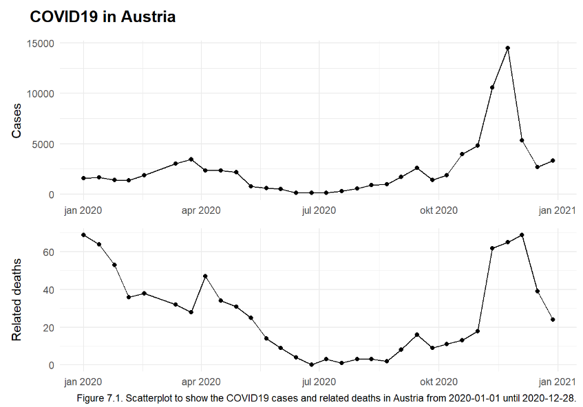
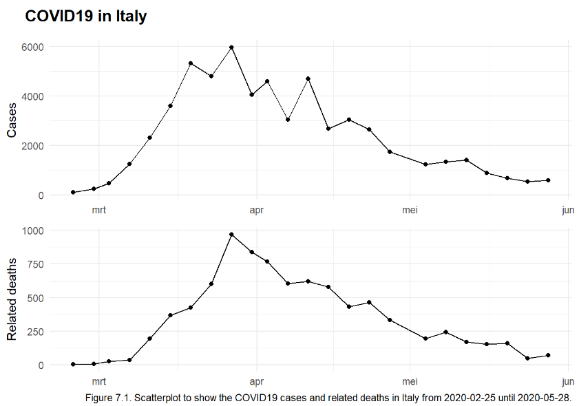

# Parameters {#parameters}

_As part of assignment 9 from the [DSFB2 Workflows course](https://lesmaterialen.rstudio.hu.nl/workflows-reader/rmarkdownparams.html)._

----

After learning about reproducibility and creating packages, parameters are the next step in learning to create a reproducible analysis. Working with parameters will make it easier to re-use or apply the analysis to different datasets or different categories within the same dataset. In this assignment data about COVID19 cases and COVID19-related deaths will be used. The data was taken from @DataDailyNumber2022 and the parameters have been set in the YAML of the index page as shown in figure 7.1. First the analysis will be executed with the parameters as they are in figure 7.1. Later the analysis will be repeated with different inputs to show the functionality of the parameters.



----

## Inspecting the data

Before using the parameters it is important to know what data we are working with.

```{r covid19 data import, eval=FALSE}
covid19 <- read.csv("https://opendata.ecdc.europa.eu/covid19/nationalcasedeath_eueea_daily_ei/csv", na.strings = "", fileEncoding = "UTF-8-BOM")
# The data is also available as dataframe in the portrobbo package
```

```{r covid19 data inspection, eval=FALSE}
# Check columnnames and types ----
str(covid19) ## There's 11 columns, all either integer or character

# Check countries ----
uniq_val(covid19$countriesAndTerritories) ## 30 different countries took part
uniq_val(covid19$geoId) == 30 ## Each country has it's own geoID
uniq_val(covid19$countryterritoryCode) == 30 ## Each country has it's own territory code
unique(covid19$continentExp) ## All countries are European

# Check timeframe ----
min(covid19$dateRep) ## Data was taken from 01/01/2020
max(covid19$dateRep) ## Until 31/12/2021
```

----

## Creating the graphs

Two graphs will be made, one using the column 'cases' and one using the column 'deaths'. The other inputs, like timeframe and country, will be parameterized. To make this easy the parameters will only be used in the first step, to extract the useful data from the main dataset. After this, only that extracted data will be used without referencing the parameters again. The four parameters used are "country", "year", "fromMonth" and "untilMonth". 

```{r extracting data using parameters}
# Extract data ----
## The original dataset will be filtered using the parameters
covid19_cases_graph <- covid19 %>% filter(countriesAndTerritories == params$country, 
                                          year == params$year, 
                                          month == c(params$fromMonth:params$untilMonth))

# dateRep to date type ----
## To use the dateRep column as the x-axis in the graphs, it's class will be changed to 'date'
covid19_cases_graph$dateRep <- as.Date(covid19_cases_graph$dateRep, "%d/%m/%y")
```

Now that only the data specified by the parameters has been extracted, it can be used for the graphs. It is important to refer to the newly created dataset, not just for the values themselves but also when writing captions or labels. This was achieved using the paste function to adjust the strings to the extracted data. The first graph looks at the COVID19 cases and the second graph is the same except it looks at COVID19 related deaths (figure 7.2).

```{r cases graph unparameterized}
# COVID19 cases graph ----
cases <- ggplot(covid19_cases_graph, aes(x=dateRep, y=cases)) + 
  geom_point() +
  geom_line() +
  labs(y = "Cases",
       x = NULL) +
  theme_minimal()

# COVID19 deaths graph ----
deaths <- ggplot(covid19_cases_graph, aes(x=dateRep, y=deaths)) + 
  geom_point() +
  geom_line() +
  labs(y = "Related deaths",
       x = NULL) +
  theme_minimal()

# Creating graph grid ----
## Combining the plots in one grid
plots <- plot_grid(cases, deaths, labels = NULL, ncol=1, align = "v")

## Creating the title for the grid
title <- ggdraw() + 
  draw_label(paste0("COVID19 in ", covid19_cases_graph$countriesAndTerritories[1]),
    fontface = 'bold', x = 0, hjust = 0) +
  theme(
    plot.margin = margin(0, 0, 0, 22)
  )

## Final grid
plot_grid(title, plots,
  ncol = 1, rel_heights = c(0.1, 1)
)

# Parameterized caption ----
## To paramterize the caption the following line has been coded into the text chunk below
## paste0("Figure 7.1. Scatterplot to show the COVID19 cases and related deaths in ", 
## covid19_cases_graph$countriesAndTerritories[1], " from ", min(covid19_cases_graph$dateRep),
## " until ", max(covid19_cases_graph$dateRep), ".")
```

_`r paste0("Figure 7.2. Scatterplot to show the COVID19 cases and related deaths in ", covid19_cases_graph$countriesAndTerritories[1], " from ", min(covid19_cases_graph$dateRep), " until ", max(covid19_cases_graph$dateRep), ".")`_

----

## Checking parameters

Since the graphs are made using the parameters, it can easily be changed to show different data. Below are a few examples of other inputs for the parameters, with a screenshot of the resulting graphs. 

<details><summary>Germany from August 2020 until December 2020</summary>
</details>
<details><summary>Austria for all of 2021</summary>
</details>
<details><summary>Italy for February 2020 until May 2020</summary>
</details>