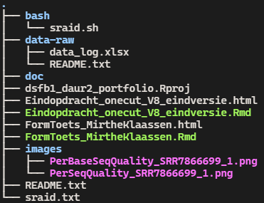

# Datamanagement

_As part of assignment 2 from the [DSFB2 Workflows course](https://lesmaterialen.rstudio.hu.nl/workflows-reader/#course-introduction)._

----

For this assignment we focused on data management. This included topics like file naming, Guerilla analytics, project structures, checksums, etc. The Guerilla analytics framework is a tool to establish an efficient, trustworthy and reproducible datamanagement workflow. It is described by Enda Ridge in [this booklet](https://www.elsevier.com/books/T/A/9780128002186). The seven core principles are:

1. Space is cheap, confusion is expensive
2. Use simple, visual project structures and conventions
3. Automate (everything - my addition) with program code
4. Link stored data to data in the analytics environment to data in work products (literate programming with RMarkdown - my addition)
5. Version control changes to data and analytics code (Git/Github.com)
6. Consolidate team knowledge (agree on guidelines and stick to it as a team)
7. Use code that runs from start to finish (literate programming with RMarkdown - my addition)

In this assignment the focus was on principle 2, "Use simple, visual project structures and conventions". This is important to avoid deep nesting of files and prepare for the way a project can evolve over time. If certain guidelines are not followed it will create problems, especially when handing a project over to someone else. The recommended guidelines are as follows:

1. Create a separate folder for each analytics project. Keep the unit of a project small.
2. Do not deeply nest folders (max 2-3 levels).
3. Keep information about the data, close to the data.
4. Store each dataset in its own sub-folder and create sub-folders within it for older versions.
5. Do not change file names or move them! If you have to, record the change in the README.
6. Do not manually edit data source files, always use code.
7. In code, use relative paths (here::here etc)
8. Use one R project per project and don’t reuse projects for other stuff.

This principle was put into practice on a previous project, from subject DAUR2. At the time the guidelines had not been discussed so the initial structure was my own personal preference, without thinking about reproducibility. For this assignment the arrangement of the files and folders within that project have been adjusted. The directory tree is shown in figure 2.1. Since DAUR2 worked with datasets given by the school, those datasets had their own location on the shared server and were not downloaded. They would have been added to the 'data-raw' folder with a subfolder per dataset.

