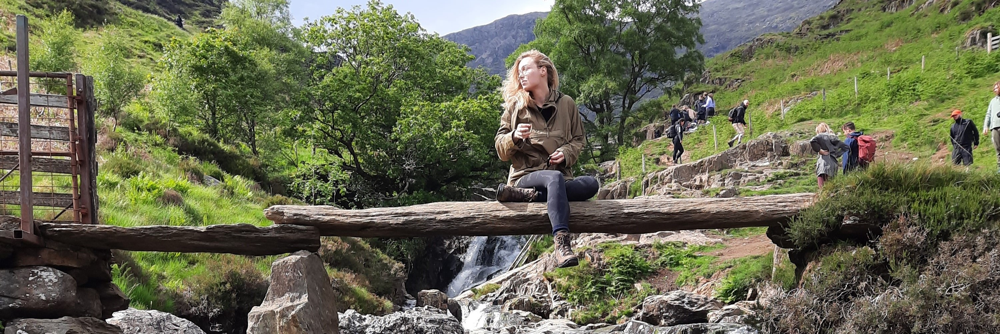

```{r setup, echo=FALSE}
# HTML file won't show messages or warnings
knitr::opts_chunk$set(message = FALSE, warning = FALSE)
```

```{r libraries, echo=FALSE}
library(portrobbo)
library(tidyverse)
library(ggplot2)
library(readxl)
library(stringi)
library(knitr)
library(dslabs)
library(DBI)
library(car)
library(FSA)
```



# Curriculum Vitae {-}

----

## Contact {-}
<i class="fa fa-home"></i> Utrecht, The Netherlands<br>
<i class="fa fa-envelope"></i> mirtheklaassen@outlook.com<br>
<i class="fa fa-briefcase"></i> [Linkedin](https://www.linkedin.com/in/mirtheklaassen020597/)<br>
<i class="fa fa-camera"></i> [Instagram](https://www.instagram.com/nn.irthe/)

----

## Profile {-}
I'm goal-oriented, curious, analytical and versatile with a passion for molecular biology and data science. I want to apply my skills in unraveling patterns and pathways in the field of bioinformatics. Along with combining my wide range of interests this would give me the opportunity of contributing to the development of big data analysis and support biomedical research.

----

## Job experience {-}
__Management Assistent, Fitness Factory, Utrecht__<br>
_June 2017 - Oktober 2018_
<ul><li>My responsibilities included the remodelling projects, contact with externals, hiring and teaching new employees, basic accountancy, inventory management and technical maintenance.</li>
<li>Also active as spinning-instructor.</li></ul>

__Examtrainer Math, Lyceo, Utrecht__<br>
_March 2018 - September 2018_

__Sales employee, Lens Utrecht, Utrecht__<br>
_May 2018 - August 2019_

__Management Assistant, TrainMore Black Label, Utrecht__<br>
_August 2019 - September 2020_
<ul><li>My responsibilities included directing the sales-team, technical maintenance, inventory management, member administration, contacting debtors/debt collection agencies and contact with externals.</li>
<li>Also active as kickboxing- and HIIT-instructor.</ul>

__Webdeveloper, WisMon, Utrecht__<br>
_March 2021 - September 2021_

__Sales employee, Pipoos, Utrecht__<br>
_September 2022 - Present_

----

## Education {-}
__Communication & Multimedia design, Avans, Den Bosch__<br>
_September 2015 - December 2017_
<ul><li>With a personal focus on front-end webdevelopment and datavisualisation</li></ul>

__Optometry, University of Applied Sciences, Utrecht__<br>
_September 2018 - Augustus 2019_

__Biology & Medical Labresearch, University of Applied Sciences, Utrecht__<br>
_September 2020 - Present_
<ul><li>GPA of 4.0</li>
<li>Honours star in genetic recombination and transfection</li>
<li>Specialization in Data Science for Biology</li></ul>

----

## Skills {-}

__Informatics:__ _Basic R, basic BASH, HTML and CSS_<br>
__Design:__ _Adobe Photoshop, Adobe Illustrator and Adobe InDesign_

----

## Volunteering {-}
__Design-expert, Innovation in a Week, Veghel__<br>
_July 2016_
<ul><li>Won the 'Teamwork-award'</li></ul>

__Student Association Uerius Brabus, Den Bosch__<br>
_October 2015 - December 2016_
<ul><li>Active as co-founder, captain of the PR committee and active in the committee for external contacts</li></ul>

----

## Languages {-}

__Dutch:__ _native speaker_<br>
__English:__ _level C1_